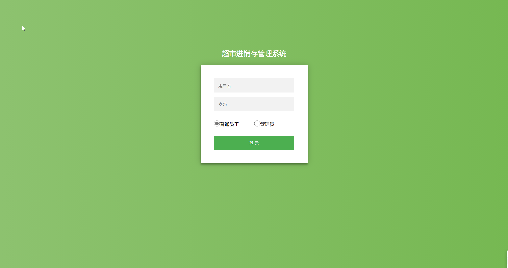
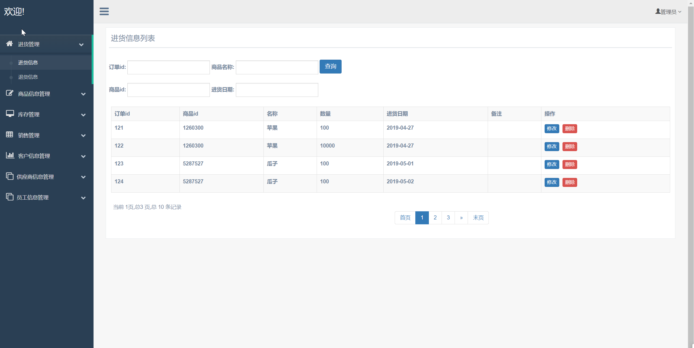
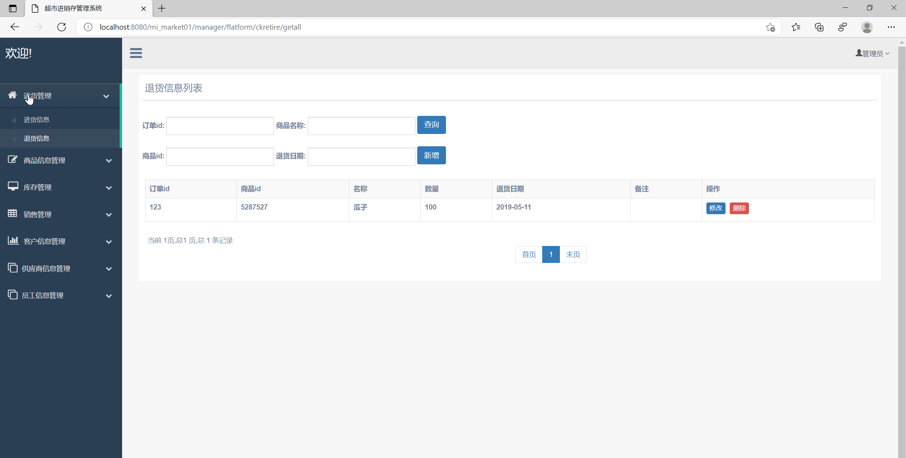
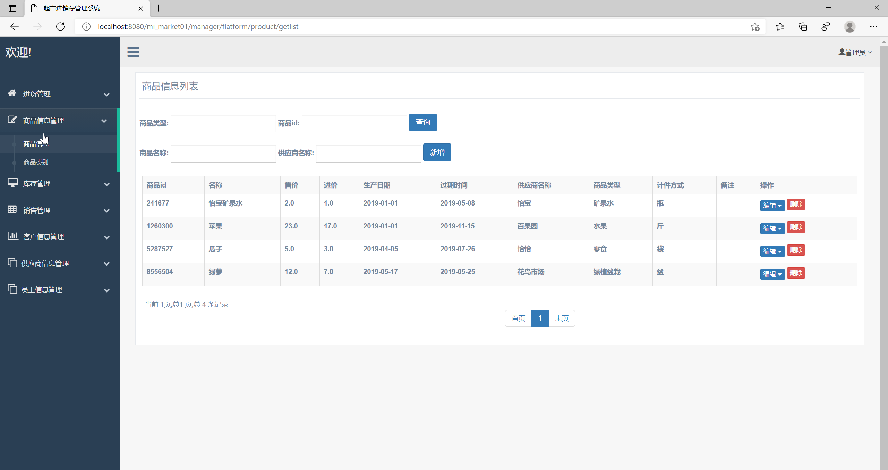
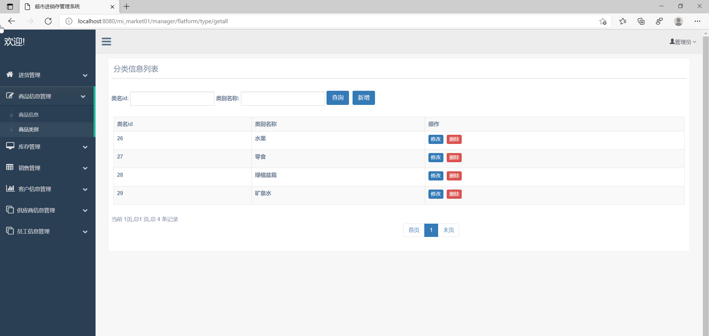
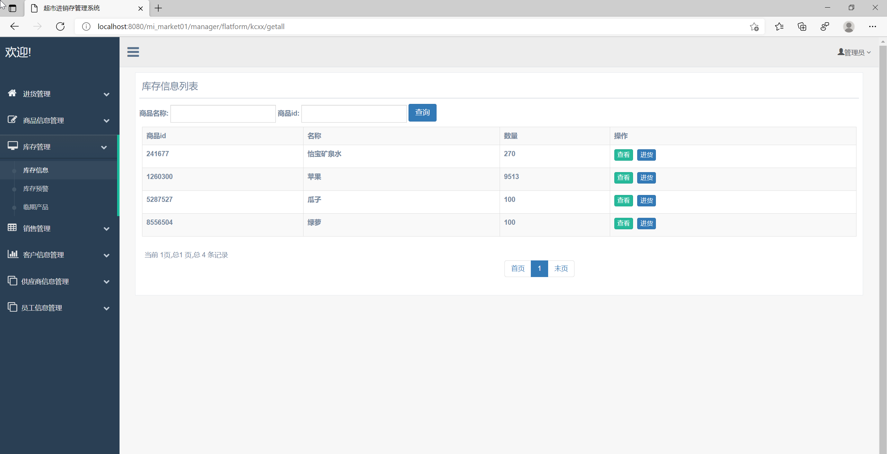
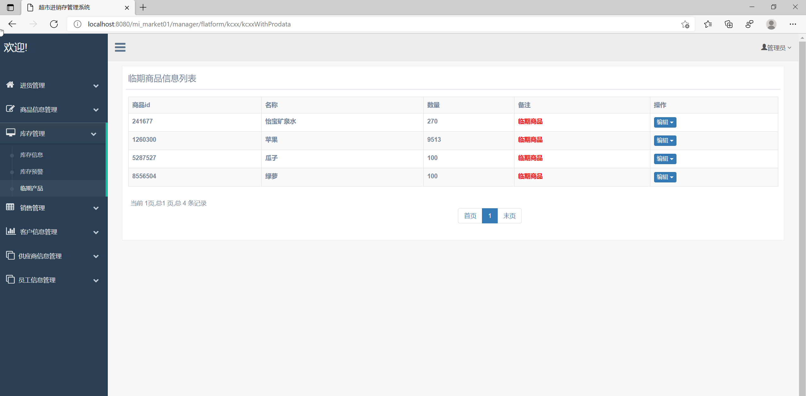
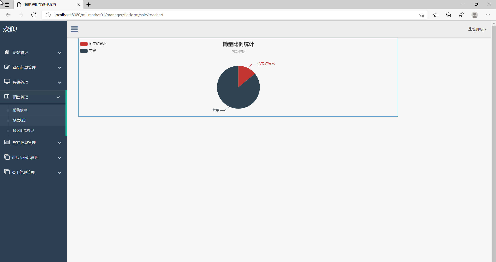
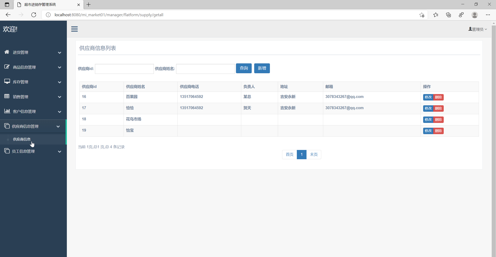
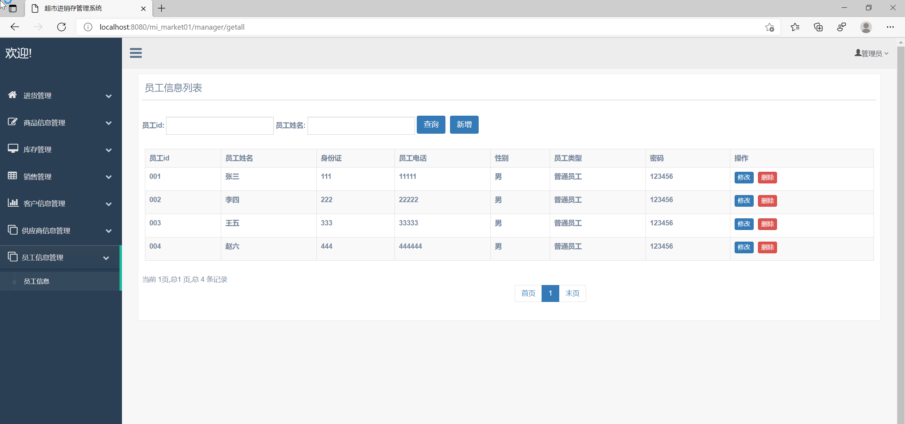

## 基于SSM框架的进销存管理系统

- <b>完整代码获取地址：从戎源码网 ([https://armycodes.com/](https://armycodes.com/))</b>
- <b>技术探讨、资料分享，请加QQ群：692619798</b> 
- <b>作者微信：19941326836  QQ：952045282</b> 
- <b>承接计算机毕业设计、Java毕业设计、Python毕业设计、深度学习、机器学习</b>
- <b>选题+开题报告+任务书+程序定制+安装调试+论文+答辩ppt 一条龙服务</b>
- <b>所有选题地址 ([https://github.com/YuLin-Coder/AllProjectCatalog](https://github.com/YuLin-Coder/AllProjectCatalog)) </b>

## 项目介绍
基于SSM框架的进销存管理系统，有普通员工和管理员两个角色，主要功能如下

1. 进货管理：记录进货信息、退货信息
2. 商品信息管理：管理商品的名称、价格、库存、规格、条形码等信息
3. 库存管理：记录实时的库存情况，设置库存预警值，提醒管理人员及时采购。同时跟踪临期产品，避免过期。
4. 销售管理：记录销售信息，提供销售统计报表，并支持顾客退货办理
5. 客户信息管理：方便收集和管理客户信息，包括联系方式和消费记录等
6. 供应商信息管理：记录供应商的基本信息、联系方式、经营范围等
7. 员工信息管理：管理员工的基本信息和工作职责

## 项目技术
- 编程语言：Java
- 数据库：MySQL
- 前端技术：JSP、JavaScript、bootstrap、JQuery
- 后端技术：Spring、SpringMVC、MyBatis

## 运行环境
- JDK版本：JDK1.8及以上
- 开发工具：IDEA、Ecplise、Myecplise都可以
- 数据库: MySQL5.7及以上
- Maven：maven3.0及以上

## 运行截图

